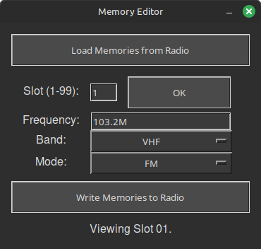
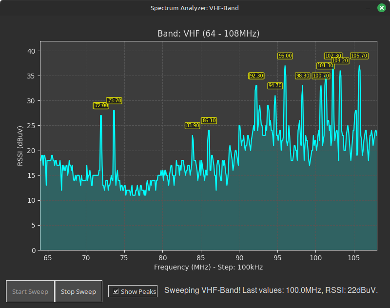

# Mini-Radio Control GUI

This Python application provides a graphical user interface (GUI) to control an ESP32-based SI4732 radio receiver via a serial connection. It allows users to easily manage various radio functions, edit memories, and analyze the radio spectrum without needing to send raw serial commands manually.


## Features:

* **Intuitive GUI:** A user-friendly interface built with `guizero` for controlling radio operations.
* **Consistent Dark Theme:** A visually comfortable and cohesive dark theme across all windows.
* **Serial Port Management:**
    * Automatically detects available serial ports.
    * Attempts to pre-select a likely port based on common USB-to-Serial chip names (e.g., CH340, CP210, FTDI) or generic terms like "USB SERIAL".
    * Allows users to select the correct port and **baud rate** from dropdown menus.
    * Provides a "Connect"/"Disconnect" toggle button to establish, terminate, and re-establish the serial connection with status feedback.
* **Radio Control Functions:**
    * Encoder Rotate (Frequency Up/Down, Menu Scroll)
    * Encoder Button Press
    * Volume Up/Down
    * Next/Previous Band
    * Next/Previous Mode (FM/LSB/USB/AM)
    * Next/Previous Step Size
    * Next/Previous Bandwidth
    * AGC/Attenuator Next/Previous
    * Backlight Brighter/Dimmer
    * Calibration Up/Down
    * Sleep Timer On/Off
* **Real-time Status Display:**
    * Firmware Version
    * Current Frequency (displayed in MHz for FM, kHz for AM/SSB, with BFO for SSB)
    * Current Band and Mode
    * Volume Level (value and percentage)
    * Battery Level (voltage and percentage)
    * Step Size, Bandwidth, AGC Status
    * Signal Strength (RSSI and SNR)
* **Configurable Cyclic Status Reading:**
    * A checkbox allows users to enable or disable the continuous polling of status information from the radio.
* **Memory Editor (Enhanced):**
    * Opens in a separate window.
    * **Edit, view, and batch-write** all 32 memory slots.
    * **Robust frequency input:** Accepts flexible formats like `102.3M`, `7100k`, `1.84m`, `7000000`, `3.5m`, `7880,5k`, etc.
        * Case-insensitive units (M, MHz, k, kHz, Hz) are supported.
        * Both dot and comma are accepted as decimal separators.
        * Flexible input order for components.
    * "Load Memories from Radio" button fetches and displays stored memory channels (01-32).
    * Intelligently parses memory data, accommodating different formats (3-part or 4-part lines).
    * **All memory slots are always written in a single batch** (empty slots are sent as placeholders).

    

* **Spectrum Analyzer:**
    * Opens in a separate, non-resizable window to display a real-time spectrum plot (RSSI vs. Frequency) for the band currently active on the radio.
    * **Intelligent Peak Detection:**
        * "Show Peaks" checkbox to toggle the display of detected signal peaks.
        * Employs an advanced algorithm that calculates a *local average RSSI* within a configurable window around each data point.
        * The peak detection threshold is dynamically adjusted based on this local average plus a defined offset. This adaptive approach allows for reliable identification of significant signals even with varying noise floors across the band, minimizing clutter from minor fluctuations.
    * **Dynamic Visualization:**
        * The Y-axis (RSSI) dynamically scales to fit received signal strengths, with configurable padding for better readability.
        * The area under the spectrum curve is filled for enhanced visual clarity.
    * **Supports FM (VHF) and all shortwave/AM/SSB bands.**
    * **Controls:** "Start Sweep" and "Stop Sweep" buttons to manage the spectrum scanning process.
    * **Usage Note:** To analyze the spectrum of a different band, the Spectrum Analyzer window must be closed. Then, select the new band using the main radio controls in the application, and finally, reopen the Spectrum Analyzer window.

    

* **General Improvements:**
    * UI buttons have consistent width and layout.
    * Status labels and error messages for user feedback.
    * Clean shutdown and resource management.

## How it Works:

The application sends single-character commands to the SI4732 radio (as documented for many ESP32-SI4732 projects) over the selected serial port.
When "Enable Cyclic Reading" is active, it periodically reads a comma-separated status string from the radio, parses it, and updates the relevant display fields in the GUI. This is toggled via a 't' command.
The Memory Editor sends a '$' command to the radio to request the memory dump. When writing, the edited memory data is sent in a batch.
The Spectrum Analyzer repeatedly sends an "Encoder Rotate Right" command ('R') to step through frequencies, receiving and plotting the RSSI for each step.

## Technologies Used:

* **Python 3**
* **pyserial:** For serial communication.
* **guizero:** For creating the graphical user interface.
* **matplotlib:** For plotting the spectrum in the Spectrum Analyzer.

## Getting Started:

### Running from Source (Python 3 required)

1.  **Prerequisites:**
    * Ensure you have **Python 3.7+** installed on your system.
    * An ESP32-SI4732 based radio receiver flashed with firmware that supports serial control, the described log output format, memory dump via '$', and frequency stepping via 'R'.

2.  **Installation of Dependencies:**
    Open your terminal or command prompt and install the necessary Python libraries:
    ```bash
    pip install guizero pyserial matplotlib
    ```

3.  **Running the Application:**
    * Connect your ESP32-SI4732 radio to your computer via USB.
    * Download or clone this repository.
    * Navigate to the directory containing `MiniRadio.py` (or whatever your main file is named).
    * Run the script:
        ```bash
        python MiniRadio.py
        ```
    * The application will attempt to auto-select a serial port and will use a default baud rate (115200). Adjust these via the dropdowns if necessary.
    * Click the "Connect" button. It will change to "Disconnect" upon successful connection.
    * Check the "Enable Cyclic Reading" checkbox to see live status updates from the radio.
    * Use the buttons and feature windows to control and explore your radio.

### Creating an Executable (Optional)

It is possible to create a standalone executable from the Python script using tools like **PyInstaller**. This has been successfully tested on Linux. This can be useful for distributing the application without requiring users to install Python or dependencies.

For example, after installing PyInstaller (`pip install pyinstaller`), you might navigate to the script's directory and run a command similar to:
```bash
pyinstaller --onefile --windowed MiniRadio.py
